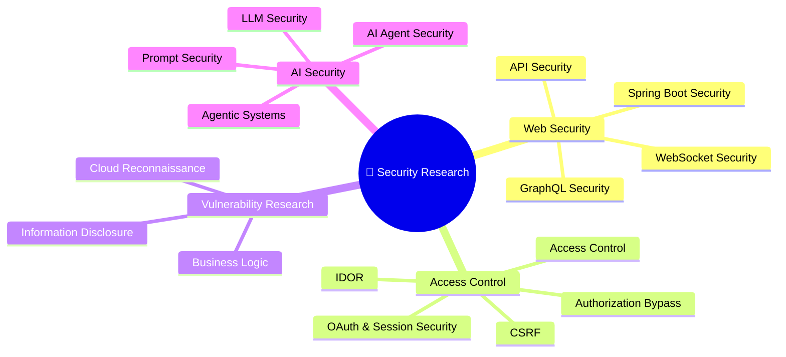
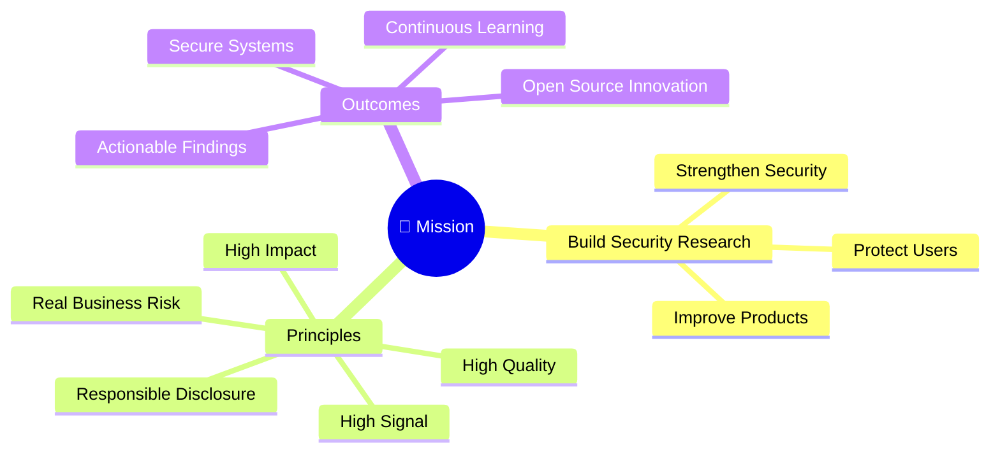

<div align="center">


</div>

<p align="center">

</p>

```bash
LifeJiggy@github:~$ run system-status

✔ LLM Integration: ACTIVE
✔ Security Research: RUNNING
✔ Agentic Workflows: OPERATIONAL
✔ Open Source Contributions: MERGING
✔ Runtime Reliability: MONITORING
✔ Bug Bounty Mode: ENGAGED
✔ ArkhAngel Protocol: ENABLED

Status: BUILDING THE FUTURE 🚀

Current Mode: > BUILD > CONTRIBUTE > HUNT > IMPROVE > REPEAT Status: ArkhAngel Mode Activated 🔥
```


<p>
  
  
  
</p>


# 👋 Hi, I'm Stephen (LifeJiggy)

Bug Bounty Hunter • Open Source Contributor • AI/LLM Engineer • Developer Program Member • Chess Player

I build security tooling, agentic AI systems, and developer infrastructure focused on automated vulnerability discovery, runtime reliability, and intelligent workflow automation.

My work spans AI security, agent orchestration, open-source engineering, and multi-model LLM integration, with a strong focus on building practical systems that improve security research, developer productivity, and operational resilience.

I actively contribute to leading agentic AI and developer ecosystems, delivering features, bug fixes, security hardening, and system enhancements across multiple open-source projects.

Current interests include AI security, autonomous agents, runtime reliability, developer tooling, security automation, and scalable agentic infrastructure.


  


  


---

## 🏆 Recognition & Developer Programs

<p align="center">
  
  
  
  
  
  
  
  
  
  
  
  
  
  
  
</p>


## 🌟 Open Source Contributor Badges

<p align="center">
  
  
  
  
</p>


## 🔬 Focus Areas

• Bug Bounty Hunting (critical, high-impact vulnerability discovery, validation & responsible disclosure)

• Web Application Security (OWASP Top 10, business logic flaws, API security, authorization weaknesses)

• AI / LLM Security (prompt injection, jailbreaks, tool abuse, agent exploitation, unsafe execution paths)

• Agentic AI Systems (multi-agent workflows, tool orchestration, memory systems, runtime reliability)

• Open Source Engineering (feature development, bug fixes, security hardening, system enhancement)

• Security Automation & Developer Tooling (CLI tools, scanning pipelines, validation frameworks, workflow automation)

• Runtime Reliability & Infrastructure (process lifecycle management, recovery systems, observability, fault tolerance)

---

## 🛠 Tech Stack

### Languages

<p>
  
  
  
  
</p>


---

**Security & Development Tools**

<p>
  
  
  
  
  
  
  
  
</p>

---

**AI / Automation**

<p>
  
  
  
  
</p>


---

**LLM Integration Stack**

<p>
  
  
  
  
  
  
  
  
  
  
  
  
</p>
</p>


---

### Operating System 

<p>
  
  
  
  
</p>
---


## 🔧 What I Build

• Agentic AI systems (multi-agent orchestration, tool execution, memory workflows, task routing)

• AI-powered security tooling (LLM-assisted vulnerability discovery, validation and analysis)

• Security-focused CLI tools (automation, reconnaissance, workflow acceleration, operational tooling)

• Open-source infrastructure improvements (runtime reliability, platform hardening, developer experience)

• LLM-integrated developer tooling (code analysis, generation, refactoring, workflow automation)

• Bug bounty automation pipelines (recon → analysis → validation → reporting)

• Autonomous workflows powered by markdown-driven execution and agent collaboration

• AI-assisted security research frameworks (prompt security, agent safety, model behavior analysis)

• Runtime observability and reliability systems (recovery, lifecycle management, fault tolerance)

• Web security and reconnaissance utilities (asset discovery, analysis and validation)

---

## 🚀 Core Projects

### 🤖 Agentic AI Platforms

- **[Ghost 👻](https://github.com/LifeJiggy/Ghost-AGI)** *(Python)*
  - AI-powered vulnerability scanner with agentic workflows, multi-model reasoning, and automated security reporting.

- **[Grok-Code CLI](https://github.com/LifeJiggy/Grok-Code-CLI)** *(TypeScript)*
  - Multi-agent coding platform with multi-provider LLM integration, tool execution, and autonomous development workflows.

- **[Arkhangel](https://github.com/LifeJiggy/Arkhangel)** *(Python)*
  - Agent orchestration platform coordinating autonomous agents, memory, tools, and multi-model reasoning.

- **[Prometheus-Loop](https://github.com/LifeJiggy/Prometheus-Loop)**
  -  Autonomous execution loop for long-running AI agents, orchestration, and workflow automation. |

- **[subagent-loop](https://github.com/LifeJiggy/subagent-loop)**
 -Reusable sub-agent runtime enabling collaborative and modular AI agent execution. |

---

### 🧠 AI Engineering & Knowledge Systems


- **[MAM (Markdown as Modules)](https://github.com/LifeJiggy/MAM)**
  - Markdown-first modular architecture for AI systems, reusable workflows, and executable documentation. |

-**[LLM-Agentic-Rules-Framework](https://github.com/LifeJiggy/LLM-Agentic-Rules-Framework)** 
  - Structured rules and guardrails for reliable multi-agent AI systems. |

- **[Rules-Emerging-Pattern](https://github.com/LifeJiggy/Rules-Emerging-Pattern)**
  - Research into reusable reasoning patterns and evolving agent behaviours. |

- **[Awesome-Grok-Workflows](https://github.com/LifeJiggy/Awesome-Grok-Workflows)** 
  - Curated collection of production-ready Grok workflows and automation patterns. |

- **[Awesome-Grok-Skills](https://github.com/LifeJiggy/Awesome-Grok-Skills)**
  - Open-source repository of reusable Grok skills, prompts, and capabilities. |


---

### 🛡️ Security Research & Automation

- **[Dast-Engine](https://github.com/LifeJiggy/dast-engine** *(JavaScript)*
  - JavaScript intelligence engine for web application analysis and client-side security research.

- **[Rootkit](https://github.com/LifeJiggy/Rootkit)**
  - Web reconnaissance and application mapping toolkit for bug bounty and offensive security workflows.

- **[Alpha](https://github.com/LifeJiggy/Alpha)**
  - Advanced JavaScript intelligence and reconnaissance framework.

- **[Hercules-Hunt](https://github.com/LifeJiggy/Hercules-Hunt)**
  - Automated reconnaissance and vulnerability discovery platform.

- **[Prompt-Hunting](https://github.com/LifeJiggy/Prompt-Hunting)**
  - AI-assisted prompt security and prompt injection research toolkit.

---

### ⚙️ Developer Tooling

- **[PR-Guide](https://github.com/LifeJiggy/PR-Guide)**
  - Open-source guide for contributing effectively to GitHub projects.

- **[OSS-System-Prompts](https://github.com/LifeJiggy/OSS-system-prompts)**
  - Curated collection of production-ready system prompts for agentic AI and open-source workflows.

- **[TCP Token Optimizer](https://github.com/LifeJiggy/TCP-Token-Optimizer)**
  - Token optimization and prompt compression toolkit for LLM applications.

- **[DevConsole Toolkit](https://github.com/LifeJiggy/DevConsole-Toolkit)**
  - Developer utilities and automation tools for AI engineering and security research.
 
- **[TCP Gateway](https://github.com/LifeJiggy/tcp-gateway)**
  - API gateway and infrastructure components for scalable integrations.


---

### 🌍 Open Source Ecosystem (2026)

Building an ecosystem of open-source tools focused on:

- 🤖 Agentic AI Systems
- 🧠 Multi-Agent Architectures
- 🔗 Multi-Provider LLM Integration
- 📝 Markdown as Modules (MAM)
- ⚙️ AI Developer Tooling
- 🛡️ Security Research & Automation
- 🌍 Open Source Infrastructure
- 🚀 Autonomous Development Workflows

---

## Research Philosophy

I focus on finding vulnerabilities that demonstrate real security boundaries rather than theoretical weaknesses.

My methodology emphasizes:

- Reproducible findings
- Clear business impact
- High-quality proof of concept
- Responsible disclosure
- Root cause analysis
- Practical remediation

Every report is written to help engineers reproduce, understand, and fix the issue—not simply identify it.

---

## 🔬 Security Research



---

## Research Metrics

- 50+ Vulnerabilities Submitted
- Multiple Valid Reports
- Hall of Fame Recognition
- Multiple Duplicate Confirmations
- High/Critical Findings Under Review
- Reports Across Fortune 500 Companies

## 🎯 Mission




## Progress Timeline

2025

✓ First Bug Bounty Report

✓ First Duplicate

✓ First Open Source Contributions

2026

✓ First Valid Reports

✓ Hall of Fame

✓ Multiple High Severity Reports

✓ WebSocket Research

✓ GraphQL Research

First Triaged 

Diamond player from chess ♟️ 

⏳ First Bounty


## 🌱 Currently Working On

🌱 Currently Working On

• Agentic AI systems for autonomous vulnerability discovery and validation

• AI-assisted security tooling (LLM + SAST/DAST hybrid workflows)

• Runtime reliability improvements across open-source agent ecosystems

• OSS contributions to OpenClaude, Hermes-Agent, KiloCode, KimiCode and related projects

• Advanced bug bounty workflows (automated recon → analysis → validation pipelines)

• LLM security research (prompt injection, agent exploitation, tool safety, memory trust boundaries)

• Local + cloud AI infrastructure (Ollama, self-hosted models, API orchestration, multi-model systems)

---


## 🤝 Collaboration

Open to collaborating on:

• Security research (vulnerability discovery, exploit chains, defensive engineering)

• AI / LLM security research (agent safety, prompt security, tool execution boundaries)

• Agentic AI systems (multi-agent architectures, orchestration, reliability engineering)

• Open-source developer tooling (CLI tooling, automation frameworks, infrastructure utilities)

• Runtime reliability and platform hardening initiatives

• OSS ecosystem improvements focused on maintainability, scalability and operational stability

---


[](https://github.com/LifeJiggy)


## 📫 Connect

<p>
  <a href="https://x.com/ArkhLifeJiggy">
    
  </a>
  
  <a href="https://arkhangel-lifejiggy.vercel.app">
    
  </a>

  <a href="https://www.bugcrowd.com/h/ArkhAngelLifeJiggy">
    
  </a>

  <a href="https://hackerone.com/arkhangellifejiggy">
    
  </a>

  <a href="https://pypi.org/user/Arkhangellifejiggy">
    
  </a>

  <a href="https://www.npmjs.com/~arkhangellifejiggy">
    
  </a>
</p>


**Discord:** @arkhangellifejiggy

**Email:** Bloomtonjovish@gmail.com

---

**⭐ Open to collaborating on open-source infrastructure, agentic AI systems, developer tooling, security research, and high-impact engineering projects.**

**"From Zero to Hero"** — Started with curiosity, persistence, and a willingness to learn. Navigated rejections, failed attempts, difficult reviews, merge conflicts, countless debugging sessions, and platform restrictions. Kept building anyway.

Today, that journey has grown into contributor badges across multiple agentic projects, merged pull requests, developer program memberships (GitHub, Google, Nvidia, Meta, Minimax), open-source tools like Rootkit, and meaningful security research contributions. 

Currently focused on high-impact bug bounty hunting, agentic workflow systems, and building the next generation of security tooling.


⚔️ **ArkhAngel Mode Activated**


**Building. Hacking. Hunting. Learning. Contributing. Improving.**


🚀 **The mission remains the same: create value, solve hard problems, and leave every system better than I found it.**

