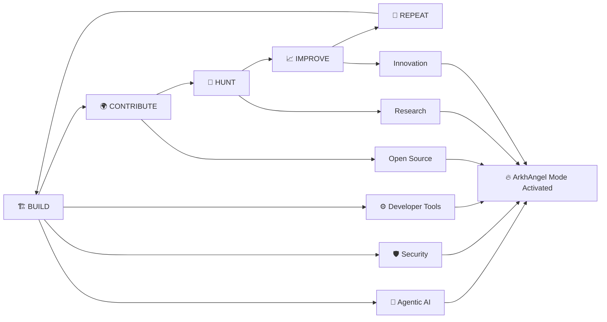
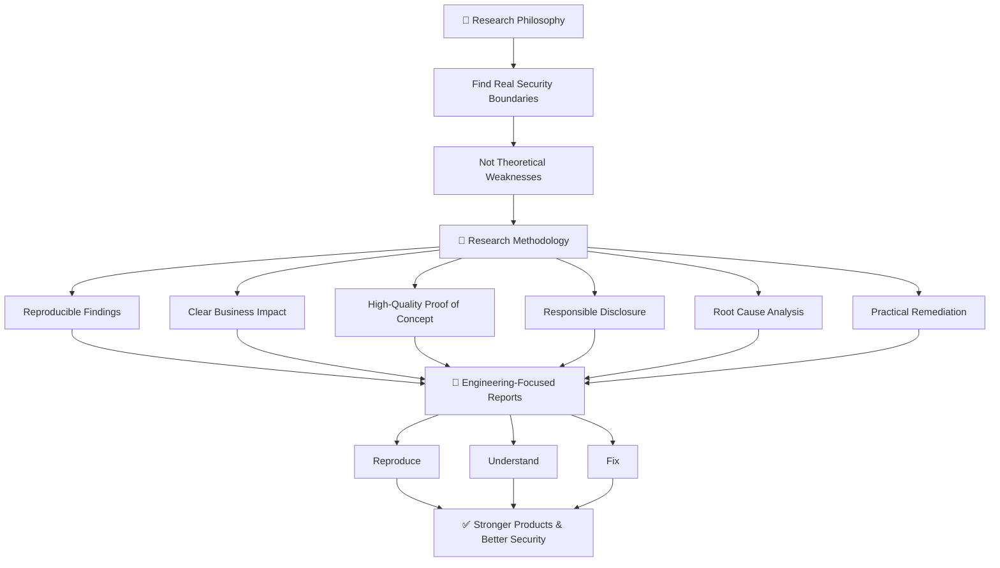
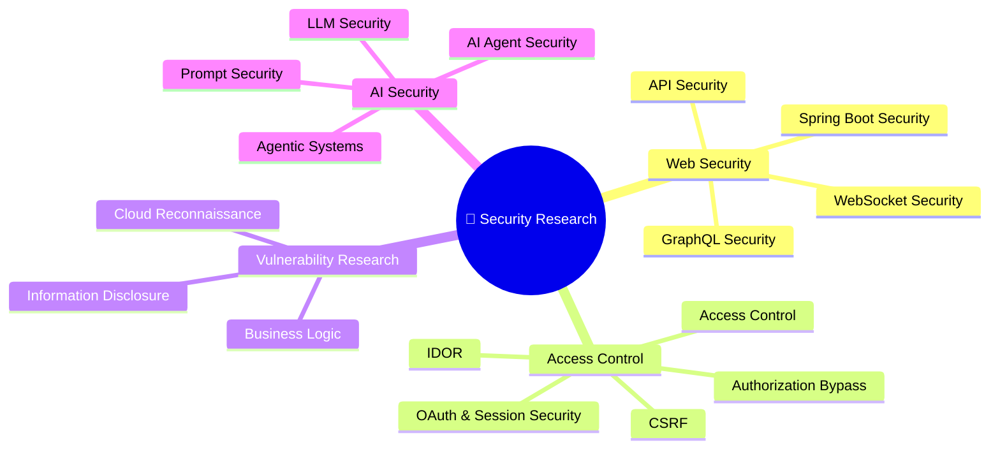
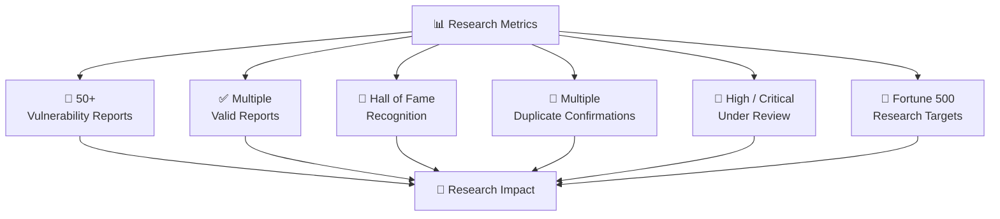
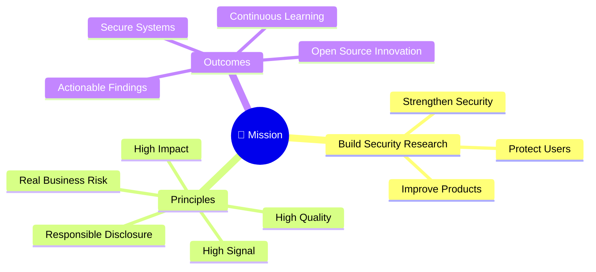
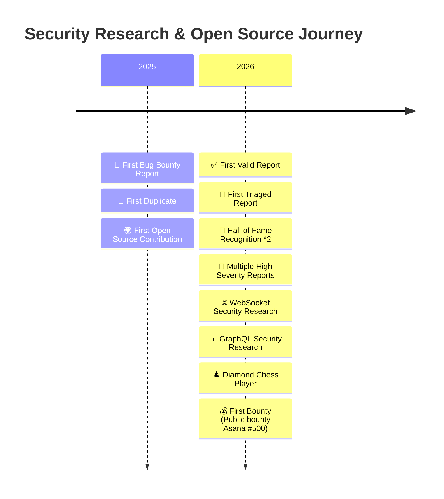

<div align="center">


</div>

<p align="center">

</p>


```bash
LifeJiggy@github:~$ tcp system-status

[✓] AI Infrastructure          :: ACTIVE
[✓] Agentic Systems            :: EVOLVING
[✓] LLM Integration            :: OPERATIONAL
[✓] Cybersecurity Research    :: ACTIVE
[✓] Security Intelligence     :: RUNNING
[✓] Developer Infrastructure  :: BUILDING
[✓] Open Source Ecosystem     :: GROWING
[✓] Runtime Reliability       :: MONITORING
[✓] Bug Bounty Research       :: ENGAGED
[✓] MAM / Modular Systems     :: EVOLVING

$ tcp mission

> Turn ideas into production-grade systems.
> Build reusable infrastructure.
> Contribute to open source.
> Solve hard problems.
> Evolve every system through real-world use.

$ tcp philosophy

BUILD > CONTRIBUTE > RESEARCH > HUNT > IMPROVE > EVOLVE > REPEAT

$ tcp ecosystem

AI + AGENTS + SECURITY + OPEN SOURCE
              ↓
       TCP ECOSYSTEMS

$ tcp status

SYSTEMS:     EVOLVING
FOUNDATION:  ACTIVE
ECOSYSTEM:   BUILDING
MODE:        ARKHANGEL 🔥

$ tcp command

Build once.
Reuse everywhere.
Evolve continuously.

Status: TCP ECOSYSTEM — ACTIVE 🚀
```

<p align="center">
  
  
  
  
</p>

<p align="center">
  
  
  
  
</p>


# 👋 Hi, I'm Stephen (ArkhAngelLifeJiggy)— Founder of TCP Ecosystem.

Founder • Bug Bounty Hunter • Open Source Contributor • AI/LLM Engineer • Developer Program Member • Chess Player

I build and lead open-source systems at the intersection of AI infrastructure, agentic engineering, cybersecurity, and developer tooling.

Through TCP Ecosystem, I’m developing reusable, production-oriented systems that turn complex technical ideas into working infrastructure, intelligent workflows, and evolving open-source solutions.

My work spans AI/LLM integration, autonomous agents, security intelligence, offensive security research, runtime engineering, developer infrastructure, and workflow automation — with a focus on building systems that are practical, composable, and designed to evolve.

I actively contribute to and collaborate across open-source AI and developer ecosystems, working on features, integrations, security improvements, architecture, tooling, and system reliability.

As a founder, my focus is not just on individual tools, but on building an ecosystem where systems, contributors, research, and ideas can compound into useful technology.

Current focus: AI infrastructure • Agentic systems • AI security • Offensive security • Open-source ecosystems • Runtime reliability • Developer tooling • Intelligent automation


## ⚙️ Current Operating Mode


```mermaid
flowchart LR

    A["🏗️ BUILD"]
    --> B["🌍 CONTRIBUTE"]
    --> C["🎯 HUNT"]
    --> D["📈 IMPROVE"]
    --> E["🔁 REPEAT"]

    E --> A

    A --> F["🤖 Agentic AI"]
    A --> G["🛡️ Security"]
    A --> H["⚙️ Developer Tools"]

    B --> I["Open Source"]
    C --> J["Research"]
    D --> K["Innovation"]

    F --> L["🔥 ArkhAngel Mode Activated"]
    G --> L
    H --> L
    I --> L
    J --> L
    K --> L
```


  


  


---

## 🏆 Recognition & Developer Programs

<p align="center">
  
  
  
  
  
  
  
  
  
  
  
  
  
  
  
</p>


## 🌟 Open Source Contributor Badges

<p align="center">
  
  
  
  
</p>


## 🔬 Focus Areas

• Bug Bounty Hunting (critical, high-impact vulnerability discovery, validation & responsible disclosure)

• Web Application Security (OWASP Top 10, business logic flaws, API security, authorization weaknesses)

• AI / LLM Security (prompt injection, jailbreaks, tool abuse, agent exploitation, unsafe execution paths)

• Agentic AI Systems (multi-agent workflows, tool orchestration, memory systems, runtime reliability)

• Open Source Engineering (feature development, bug fixes, security hardening, system enhancement)

• Security Automation & Developer Tooling (CLI tools, scanning pipelines, validation frameworks, workflow automation)

• Runtime Reliability & Infrastructure (process lifecycle management, recovery systems, observability, fault tolerance)

---

## 🛠️ Tech Stack

Languages & Scripting

<p>
  
  
  
  
  
  
</p>

Systems & Modules

<p>
  
  
  
</p>

AI / LLM

<p>
  
  
  
  
  
  
  
  
  
</p>

Security & Research

<p>
  
  
  
  
  
    
</p>

Development & Infrastructure

<p>
  
  
  
  
  
</p>

«Core approach: Markdown/MAM for modular system definition, Python and JavaScript/TypeScript for implementation and runtime engineering, and AI/LLM infrastructure for intelligent orchestration and automation.»


---

**LLM Integration Stack**

<p>
  
  
  
  
  
  
  
  
  
  
  
  
</p>
</p>


---

### Operating System 

<p>
  
  
  
  
</p>
---


## 🔧 What I Build

• Agentic AI systems (multi-agent orchestration, tool execution, memory workflows, task routing)

• AI-powered security tooling (LLM-assisted vulnerability discovery, validation and analysis)

• Security-focused CLI tools (automation, reconnaissance, workflow acceleration, operational tooling)

• Open-source infrastructure improvements (runtime reliability, platform hardening, developer experience)

• LLM-integrated developer tooling (code analysis, generation, refactoring, workflow automation)

• Bug bounty automation pipelines (recon → analysis → validation → reporting)

• Autonomous workflows powered by markdown-driven execution and agent collaboration

• AI-assisted security research frameworks (prompt security, agent safety, model behavior analysis)

• Runtime observability and reliability systems (recovery, lifecycle management, fault tolerance)

• Web security and reconnaissance utilities (asset discovery, analysis and validation)

---

## 🚀 Core Projects

### 🤖 Agentic AI Platforms

- **[Ghost 👻](https://github.com/LifeJiggy/Ghost-AGI)** *(Python)*
  - AI-powered vulnerability scanner with agentic workflows, multi-model reasoning, and automated security reporting.

- **[Grok-Code CLI](https://github.com/LifeJiggy/Grok-Code-CLI)** *(TypeScript)*
  - Multi-agent coding platform with multi-provider LLM integration, tool execution, and autonomous development workflows.

- **[Arkhangel](https://github.com/LifeJiggy/Arkhangel)** *(Python)*
  - Agent orchestration platform coordinating autonomous agents, memory, tools, and multi-model reasoning.

- **[Prometheus-Loop](https://github.com/LifeJiggy/Prometheus-Loop)**
  -  Autonomous execution loop for long-running AI agents, orchestration, and workflow automation. |

- **[subagent-loop](https://github.com/LifeJiggy/subagent-loop)**
 -Reusable sub-agent runtime enabling collaborative and modular AI agent execution. |

---

### 🧠 AI Engineering & Knowledge Systems


- **[MAM (Machine Agent Modules)](https://github.com/LifeJiggy/MAM)**
  - Markdown-first modular architecture for AI systems, reusable workflows, and executable documentation. |

-**[LLM-Agentic-Rules-Framework](https://github.com/LifeJiggy/LLM-Agentic-Rules-Framework)** 
  - Structured rules and guardrails for reliable multi-agent AI systems. |

- **[Rules-Emerging-Pattern](https://github.com/LifeJiggy/Rules-Emerging-Pattern)**
  - Research into reusable reasoning patterns and evolving agent behaviours. |

- **[Awesome-Grok-Workflows](https://github.com/LifeJiggy/Awesome-Grok-Workflows)** 
  - Curated collection of production-ready Grok workflows and automation patterns. |

- **[Awesome-Grok-Skills](https://github.com/LifeJiggy/Awesome-Grok-Skills)**
  - Open-source repository of reusable Grok skills, prompts, and capabilities. |


---

### 🛡️ Security Research & Automation

- **[Dast-Engine](https://github.com/LifeJiggy/dast-engine)** *(JavaScript)*
  - JavaScript intelligence engine for web application analysis and client-side security research.

- **[Rootkit](https://github.com/LifeJiggy/Rootkit)**
  - Web reconnaissance and application mapping toolkit for bug bounty and offensive security workflows.

- **[Alpha](https://github.com/LifeJiggy/Alpha)**
  - Advanced JavaScript intelligence and reconnaissance framework.

- **[Hercules-Hunt](https://github.com/LifeJiggy/Hercules-Hunt)**
  - Automated reconnaissance and vulnerability discovery platform.

- **[Prompt-Hunting](https://github.com/LifeJiggy/Prompt-Hunting)**
  - AI-assisted prompt security and prompt injection research toolkit.

---

### ⚙️ Developer Tooling

- **[PR-Guide](https://github.com/LifeJiggy/PR-Guide)**
  - Open-source guide for contributing effectively to GitHub projects.

- **[OSS-System-Prompts](https://github.com/LifeJiggy/OSS-system-prompts)**
  - Curated collection of production-ready system prompts for agentic AI and open-source workflows.

- **[TCP Token Optimizer](https://github.com/LifeJiggy/TCP-Token-Optimizer)**
  - Token optimization and prompt compression toolkit for LLM applications.

- **[DevConsole Toolkit](https://github.com/LifeJiggy/DevConsole-Toolkit)**
  - Developer utilities and automation tools for AI engineering and security research.
 
- **[TCP Gateway](https://github.com/LifeJiggy/TCP-GateWay.git)**
  - API gateway and infrastructure components for scalable integrations.


---

### 🌍 Open Source Ecosystem (2026)

Building an ecosystem of open-source tools focused on:

- 🤖 Agentic AI Systems
- 🧠 Multi-Agent Architectures
- 🔗 Multi-Provider LLM Integration
- 📝 Markdown as Modules (MAM)
- ⚙️ AI Developer Tooling
- 🛡️ Security Research & Automation
- 🌍 Open Source Infrastructure
- 🚀 Autonomous Development Workflows

---

## 📖 Research Philosophy


```mermaid
flowchart TD

    A["📖 Research Philosophy"]

    A --> B["Find Real Security Boundaries"]
    B --> C["Not Theoretical Weaknesses"]

    C --> D["🔬 Research Methodology"]

    D --> D1["Reproducible Findings"]
    D --> D2["Clear Business Impact"]
    D --> D3["High-Quality Proof of Concept"]
    D --> D4["Responsible Disclosure"]
    D --> D5["Root Cause Analysis"]
    D --> D6["Practical Remediation"]

    D1 --> E["📄 Engineering-Focused Reports"]
    D2 --> E
    D3 --> E
    D4 --> E
    D5 --> E
    D6 --> E

    E --> F["Reproduce"]
    E --> G["Understand"]
    E --> H["Fix"]

    F --> I["✅ Stronger Products & Better Security"]
    G --> I
    H --> I
```

---

## 🔬 Security Research


```mermaid
mindmap
  root((🔬 Security Research))

    Web Security
      API Security
      GraphQL Security
      WebSocket Security
      Spring Boot Security

    Access Control
      IDOR
      Authorization Bypass
      Access Control
      OAuth & Session Security
      CSRF

    Vulnerability Research
      Information Disclosure
      Business Logic
      Cloud Reconnaissance

    AI Security
      AI Agent Security
      Prompt Security
      LLM Security
      Agentic Systems
```

---

## 📊 Research Metrics


```mermaid
flowchart TD

    A["📊 Research Metrics"]

    A --> B["📨 50+<br/>Vulnerability Reports"]
    A --> C["✅ Multiple<br/>Valid Reports"]
    A --> D["🏅 Hall of Fame<br/>Recognition"]

    A --> E["🔁 Multiple<br/>Duplicate Confirmations"]
    A --> F["🚨 High / Critical<br/>Under Review"]
    A --> G["🏢 Fortune 500<br/>Research Targets"]

    B --> H["🎯 Research Impact"]
    C --> H
    D --> H
    E --> H
    F --> H
    G --> H

```
---

## 🎯 Mission


```mermaid
mindmap
  root((🎯 Mission))

    Build Security Research
      Improve Products
      Protect Users
      Strengthen Security

    Principles
      High Impact
      High Signal
      High Quality
      Real Business Risk
      Responsible Disclosure

    Outcomes
      Secure Systems
      Actionable Findings
      Open Source Innovation
      Continuous Learning
```

## 📈 Progress Timeline


```mermaid
timeline
    title Security Research & Open Source Journey

    2025 : 🚀 First Bug Bounty Report
         : 🔁 First Duplicate
         : 🌍 First Open Source Contribution

    2026 : ✅ First Valid Report
         : 🎯 First Triaged Report
         : 🏅 Hall of Fame Recognition *2 
         : 🚨 Multiple High Severity Reports
         : 🌐 WebSocket Security Research
         : 📊 GraphQL Security Research
         : ♟️ Diamond Chess Player
         : 💰 First Bounty (Public bounty Asana #500)
```


## 🌱 Currently Working On

• Agentic AI systems for autonomous vulnerability discovery and validation

• AI-assisted security tooling (LLM + SAST/DAST hybrid workflows)

• Runtime reliability improvements across open-source agent ecosystems

• OSS contributions to OpenClaude, Hermes-Agent, KiloCode, KimiCode and related projects

• Advanced bug bounty workflows (automated recon → analysis → validation pipelines)

• LLM security research (prompt injection, agent exploitation, tool safety, memory trust boundaries)

• Local + cloud AI infrastructure (Ollama, self-hosted models, API orchestration, multi-model systems)


## 🤝 Collaboration

Open to collaborating on:

• Security research (vulnerability discovery, exploit chains, defensive engineering)

• AI / LLM security research (agent safety, prompt security, tool execution boundaries)

• Agentic AI systems (multi-agent architectures, orchestration, reliability engineering)

• Open-source developer tooling (CLI tooling, automation frameworks, infrastructure utilities)

• Runtime reliability and platform hardening initiatives

• OSS ecosystem improvements focused on maintainability, scalability and operational stability

---


[](https://github.com/LifeJiggy)


## 📫 Connect

<p>
  <a href="https://x.com/ArkhLifeJiggy">
    
  </a>
  
  <a href="https://arkhangel-lifejiggy.vercel.app">
    
  </a>

  <a href="https://www.bugcrowd.com/h/ArkhAngelLifeJiggy">
    
  </a>

  <a href="https://hackerone.com/arkhangellifejiggy">
    
  </a>

  <a href="https://pypi.org/user/Arkhangellifejiggy">
    
  </a>

  <a href="https://www.npmjs.com/~arkhangellifejiggy">
    
  </a>
</p>


**Discord:** @arkhangellifejiggy

**Email:** Bloomtonjovish@gmail.com

---

**⭐⭐ Open to collaborating on open-source infrastructure, agentic AI systems, AI/LLM engineering, developer tooling, cybersecurity, security research, and high-impact engineering projects.

From Curiosity to Systems

What started with curiosity, persistence, and a willingness to learn has evolved into a continuous journey of building, contributing, breaking, fixing, and rebuilding.

The path has included rejected ideas, failed experiments, difficult reviews, merge conflicts, debugging sessions, platform restrictions, technical limitations, and countless moments where the easier choice would have been to stop.

I kept building.

That persistence eventually turned into open-source contributions, merged pull requests, developer program memberships, security research, reusable developer tooling, and systems designed to solve real technical problems.

Today, my work extends beyond individual projects.

As the founder of TCP Ecosystems, I’m building an open-source ecosystem focused on AI infrastructure, agentic systems, cybersecurity, developer tooling, and intelligent automation.

The goal is simple:

«Turn ideas into production-grade systems, and continuously evolve those systems through real-world use, research, collaboration, and open-source contribution.»

My work currently spans projects involving LLM integration, agent orchestration, runtime infrastructure, security intelligence, automated vulnerability research, developer workflows, and reusable system architectures.

I believe the strongest technology is not built once and forgotten.

It evolves.

Every experiment can become a system.
Every system can become infrastructure.
Every contribution can strengthen an ecosystem.
And every ecosystem can create opportunities for others to build on top of it.

What I'm Building Toward 🚀

TCP Ecosystem is being built around a long-term vision:

AI infrastructure + Agentic Systems + Cybersecurity + Open Source = reusable technology ecosystems.

I'm continuing to build, contribute, research, collaborate, and evolve — one system at a time.

The foundation is being built now. The ecosystem comes next.

⭐ If you're building ambitious technology and believe in open collaboration, you're welcome to build with us.


⚔️ ⚡ ArkhAngel Mode Activated

Learning. Building. Contributing. Hunting. Evolving. Open Source 

🚀 The mission remains the same: create value, solve hard problems, build systems that matter, and leave every system better than I found it.

Build the idea.
Strengthen the system.
Share the knowledge.
Evolve the ecosystem.

— ArkhAngelLifeJiggy | Founder, TCP Ecosystem
